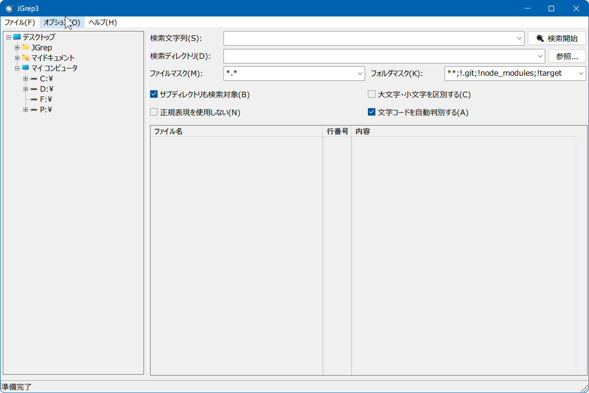
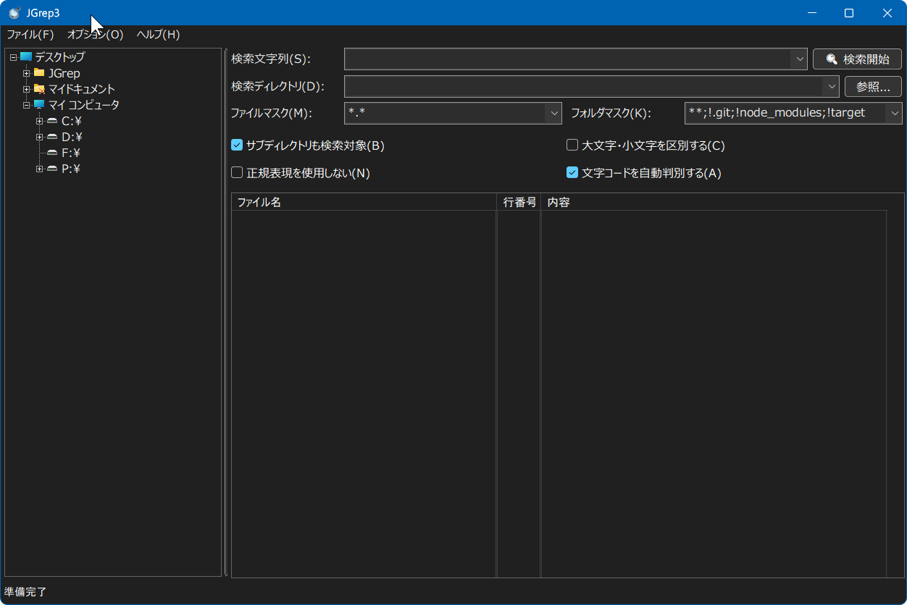

# JGrep3

Windows 向けのネイティブ GUI ファイル検索ツールです。

Rust と native-windows-gui で実装したデスクトップアプリで、**Jm（三浦淳）氏の JGrep v2.0.5** を元ネタ（参考）として作成されています。

## 特徴

- フォルダツリーから検索先を選択
- 正規表現検索 / リテラル検索
- .gitignore 構文対応の「検索フィルター」（例: `*.*; !.git/`）
- 無視ファイル（.gitignore, .ignore, .rgignore）の自動適用オプション
- サブディレクトリ検索
- 文字コード自動判別（UTF-8 / Shift_JIS / EUC-JP / ISO-2022-JP）
- ダーク / ライト / システムテーマ
- 検索結果のダブルクリックで外部エディタを起動（VS Code / サクラエディタ / 秀丸 / Notepad++ など。未設定時は `code.exe` と既定引数を自動設定）
- バックグラウンド検索・進捗表示（Esc で停止）

## スクリーンショット

| ライト | ダーク |
|--------|--------|
|  |  |

## 必要環境

- Windows 10 / 11
- ビルド時: [Rust](https://www.rust-lang.org/)（MSVC ツールチェーン）

## ビルドと実行

```bash
cargo build --release
```

成果物:

```
target/release/JGrep3.exe
```

## 使い方

1. **検索文字列** に探したい文字列（または正規表現）を入力する
2. **検索ディレクトリ** を指定する（左のフォルダツリー、または「参照...」）
3. 必要に応じて **検索フィルター** を設定する
4. **検索開始** を押す（結果は一覧に表示される）

### オプション

| 項目 | 説明 |
|------|------|
| サブディレクトリも検索対象 | 配下のフォルダも再帰的に検索する |
| 大文字・小文字を区別する | 大文字・小文字を区別してマッチする |
| 正規表現を使用しない | オフのとき正規表現、オンのとき通常の文字列検索 |
| 文字コードを自動判別する | UTF-8 / Shift_JIS / EUC-JP / ISO-2022-JP を自動判別する |
| 無視ファイル(.gitignore等)を適用 | 検索ディレクトリ配下の `.gitignore`, `.ignore`, `.rgignore` を自動でロードし適用する |

### 検索フィルター

検索フィルターは、セミコロン `;` 、カンマ `,` 、またはスペースで区切られた複数のパターンです。
`.gitignore` と同等の仕様に基づくパターンマッチング（ワイルドカード `*` `**`、否定 `!`、ディレクトリ限定末尾 `/` 等）をサポートしています。

- `*.*; !.git/` … すべてのファイルを対象とし、`.git` ディレクトリを除外する（既定値）
- `*.rs; *.toml` … `*.rs` または `*.toml` ファイルのみを対象とする
- `!node_modules/` … `node_modules` ディレクトリを除外する
- `src/` … `src` ディレクトリ配下のみを対象とする

### 検索結果

一覧には次の列が表示されます。

- ファイル名
- 行番号
- 内容（検索文字列を色付きでハイライト）

列ヘッダをクリックするとソートできます。行をダブルクリックすると、設定した外部エディタ（未設定時は VS Code、なければ関連付けアプリ）で該当位置を開きます。

### 設定

メニュー **オプション → 設定** から変更できます。

- **テーマ**: システム設定 / ライト / ダーク
- **UIフォント / サイズ**: Meiryo UI など（10〜24pt）
- **結果リストフォント / サイズ**: Cascadia Code など（10〜24pt）
- **外部エディタ**: 実行ファイルのパスと引数テンプレート
  - `%FILENAME%` (または `%FILE%`) … ファイルパス
  - `%LINE%` … 行番号
  - `%COL%` (または `%COLUMN%`) … 列番号

設定は TOML ファイルに保存されます（ポータブル優先）。

| 優先 | パス |
|------|------|
| 1 | カレントディレクトリの `JGrep3.toml` |
| 2 | `%APPDATA%\JGrep3\JGrep3.toml` |

読み込みは上の順。保存は読み込んだ場所へ上書きし、どちらも無い場合は AppData に新規作成します。

```toml
[appearance]
theme = 0
font_family = "Meiryo UI"
font_size = 16
list_font_family = "Cascadia Code"
list_font_size = 14

[editor]
path = ""
args = ""

[layout]
tree_width = 240
col_filename_width = 350
col_line_width = 60
col_content_width = 450
window_width = 1000
window_height = 680
# window_x / window_y は任意

[history]
query = []
dir = []
mask = []
```

- `appearance.theme`: `0`=システム, `1`=ライト, `2`=ダーク
- `history.*`: 検索履歴（最大100件）

## プロジェクト構成

```
src/
├── main.rs            # エントリポイント・JGrepApp UI 構造・イベントハンドラ
├── lib.rs             # クレート公開モジュール
├── config.rs          # 設定型・保存/読込・フォント定数
├── theme.rs           # カラー定数・ブラシ・ダークモード・メニュー描画
├── custom_draw.rs     # カスタム描画（リストビュー・ヘッダー・プログレスバー・ハイライト）
├── settings.rs        # 設定ダイアログ UI
├── drives.rs          # ドライブ・フォルダ列挙
├── search/
│   ├── mod.rs         # 公開 API (SearchResultItem, SearchStatus, run_search)
│   ├── gitignore.rs   # .gitignore 構文マッチングと検索フィルター
│   ├── match_engine.rs # マッチャ (リテラル / 正規表現 / 高速ASCIIパス)
│   ├── decode.rs      # ファイル読込・エンコーディング判別・バイナリ検出
│   ├── walk.rs        # ディレクトリ列挙 (Win32 FindFirstFileW)
│   └── pool.rs        # 並列ワーカプール・進捗・バッチ通知
```

## パフォーマンス

並列検索エンジンにより高速な全文検索を実現します。

参考スコア（cargo registry index: 34,573 *.rs ファイル）:

| シナリオ | 時間 |
|----------|------|
| 1,663,714 マッチ (`fn `) | ~1.0s |
| ゼロマッチ | ~0.5s |

### 最適化手法

- 並列ワーカプール（CPUスレッド数、最大8）
- memchr SIMD による高速リテラル検索
- ASCII バイト列直接検索（UTF-8ファイルでデコード不要）
- ディレクトリ列挙とファイル検索のパイプライン並列化
- バッファ再利用・バッチ通知
- バイナリファイル早期スキップ

## 謝辞

本ソフトウェアは、Jm（三浦淳）氏による **JGrep v2.0.5** を参考に作成されています。原作の優れた設計と UI に感謝します。

## ライセンス

MIT License です。詳細は [LICENSE](LICENSE) を参照してください。
